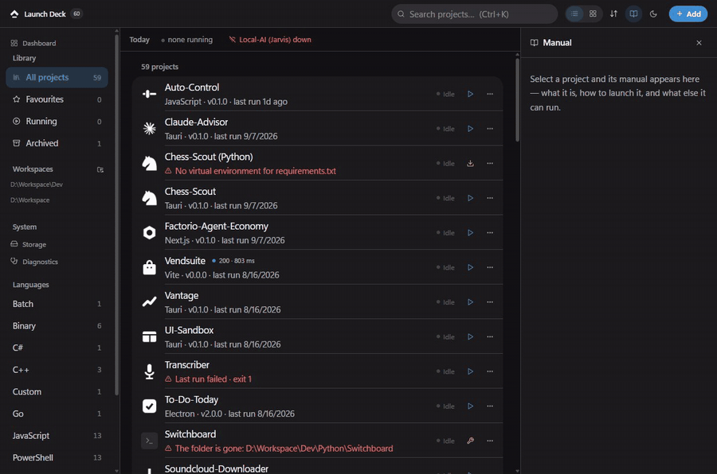

# Launch Deck

A local-first control centre for every project on one machine: it runs them,
watches them, and explains them when they break. Pointed at a real registry of
56 projects, it named a specific, repairable reason **16 of them would not
start** — before anything was clicked, from filesystem reads alone, never by
executing the project.



*One control centre for 56 real projects — dashboard, searchable library,
per-project manual and log panel, grid of marks, storage and diagnostics.
Captured 2026-09-15 from the 2026-09-14 release build; browse-only, nothing was
launched during the recording.*

Register a folder — pick it, drop it on the window, or scan a whole workspace —
and Launch Deck works out what it is, how to start it, and then runs, watches
and stops it, whatever language it happens to be written in.

Nothing leaves the machine on its own. No account, no cloud, no telemetry, no
phone-home, and no request Launch Deck decided to make by itself. It does ship
an HTTP client: a status tile can ping a URL you typed into that project's
status source, and only when the UI asks for it. The boundary is written into
the source that implements it — `crates/deck-runtime/src/surface.rs`: "only
URLs the user typed into a project's status-source config are ever contacted".

Windows-first: Tauri 2 + Rust backend, React frontend, and process supervision
built directly on Windows Job Objects.

---

## Two things worth knowing

**Stopping kills the whole tree.** Children spawn suspended into a
kill-on-close Job Object and are then resumed — so Stop actually frees the port
instead of orphaning `npm` → `node` → `vite` → esbuild workers, and even a hard
kill of Launch Deck itself cannot leave strays behind. `docs/ARCHITECTURE.md`
covers the suspended-spawn → job-assign → resume sequence, why Windows offers
no true graceful signal to a windowed app, and how the two-stage stop (stdin
EOF, then job termination) handles both the polite and the stubborn cases.

**Detection never executes anything.** Every detection rule is a read-only
filesystem or parse predicate, rule paths cannot escape the project root, and
file reads are size-capped. Scanning a folder can never run code from it —
commands only ever run from an explicit action, and they are always a program
plus an argument vector, never a string handed to a shell.

## Every row knows whether it can start

Readiness is computed before the click, over the whole library, from
filesystem reads only. Six causes, each carrying its own repair:

| Blocker | Meaning | Repair offered |
|---|---|---|
| `root` | the folder is gone | re-point it at the new folder, keeping history |
| `setup` | dependencies missing | the install command, one press |
| `program` | not installed / not on PATH | edit launch options |
| `entry` | the command names a file that is not there | edit launch options |
| `ambiguous` | `cargo run`, several binaries, no default | pick one, saved as `--bin x` |
| `unbuilt` | the built artefact the runner launches is absent | run the build step |

A failure no static check can see is carried from run history instead, and
labelled "last run failed" — never "this will fail". Evidence, not prediction.
That is how the audit surfaced a project that had failed on `import whisper`
**fourteen times in a row** with nothing on its row to say so.

## What it does today

- **Add projects three ways** — folder picker, drag-and-drop anywhere on the
  window, or a guarded workspace scan that finds everything identifiable under
  a root without walking into `node_modules`, `target` or `.git`.
- **Detects what a project is** via 32 bundled runner definitions: Node (plus
  Next.js, Vite, Tauri, Electron, React Native), Python (plus Poetry, uv),
  Rust, Go, Deno, Bun, .NET, Java (Maven and Gradle), CMake, Make, PHP (plus
  Laravel), Ruby (plus Rails), Lua, Dart, Flutter, Zig, PowerShell, shell,
  batch, and bare executables. Package managers resolve from lockfiles;
  versions read from the project's own metadata. The add dialog shows the exact
  command Run will execute *before* anything is registered — and for a folder
  nothing recognises, you type the command yourself.
- **Streams logs live** — ANSI colours, stdout/stderr/deck filters, search,
  error emphasis, copy, export, follow mode with a scroll-up pause. Output is
  held in a bounded 5,000-line ring and flushed to the UI on a 60 ms /
  400-line batch rather than one event per line, and the viewer renders that
  window as about 40 live DOM nodes. The pipeline and the reasoning are in
  `docs/ARCHITECTURE.md`.
- **Explains failures.** A crash is diagnosed from its own output where
  possible: "port 5173 is already in use", "a dependency is missing — try
  Install", not "exit code 1". Auto-restart (per-project policy) backs off
  exponentially and trips a circuit breaker instead of fork-bombing.
- **Prompt Studio** — one sentence of intent, plus the repo's context card,
  plus one of six task templates (debug, feature, refactor, design, copy,
  ship), equals a complete prompt. The preview *is* the product: every action
  ships exactly the text shown — to the clipboard, appended to the repo's
  `NEXT.md` without destroying what is already there, or into a terminal in
  that repo with `claude` already running. The clipboard copy happens first,
  so a terminal that fails to start still leaves the prompt one Ctrl+V away.
  When the log filter that feeds it matches nothing, it falls back to the raw
  tail: an empty "Recent errors" section under a crashing app would be a lie
  of omission.
- **The library leads with what you use** — pinned, then favourites, then most
  recently launched. Removing something is remembered, so the background scan
  does not put it back. Two views: a grouped list for working, and a dense grid
  of marks for launching. Same projects, same filters, different question.
- **Instant search** over names, languages, frameworks, tags and paths
  (Ctrl+K), a table view and a card view, pinned/favourite/archive,
  dark/light/system theme, keyboard navigation throughout.
- **Launch options in the GUI** — the command in one field, flags as rows you
  can switch off without losing them, and the line that will actually run shown
  above both.
- **Launch anything** — a project folder, a file, a script, a folder to open,
  or a web app. Picking a file proposes the command for its type and lets you
  correct it before saving.
- **Saved web apps** — register a URL and it lives in the library like anything
  else: searchable, watched, opened in a window inside Launch Deck. It is
  backed by a real Windows `.url` shortcut on disk, not just a row.
- **A manual for each project** — a right-hand pane with what it is, how to
  launch it, what commands it declares and where its docs are. All of it read
  off disk: the README's own first paragraph, the real `package.json` scripts.
  A project with no README says so rather than getting an invented summary.
- **Reads its own apps' status** — a status source can name an app-specific
  reader, so a tile shows Fleet's active runs, Ollama's loaded models, Lathe's
  request count or FocusForge's priority gate instead of only "it answered".
- **Storage and diagnostics** — what every project costs on disk, sorted either
  way, with a colour band for absolute size, expandable into subfolders.
  Junctions are listed but never followed, so nothing is counted twice.
- **A Today strip** and desktop integration: open a project's folder, a
  terminal in its directory, or VS Code, from the row menu.

## Measured

Counted in this tree, not from memory: `cargo test --workspace` for the Rust
totals, the suite list in `tools/verify/run-all.ps1` for the browser count,
and the launcher audit of 2026-09-14 recorded in `docs/ROADMAP.md` (Phase 18)
for the 56 projects and 475 run records. Every command is below; run them
against any later commit rather than trusting these figures.

353 Rust tests pass across the workspace, and 14 browser verification suites
drive the *shipped release binary* over CDP rather than a dev server. `cargo
clippy --all-targets` emits zero warnings with the four library crates at
`#![warn(missing_docs, clippy::all, clippy::pedantic)]`; `tsc` is strict (with
`noUncheckedIndexedAccess` and `exactOptionalPropertyTypes`) and ESLint is
clean.

| Layer | State | Tests |
|---|---|---|
| `deck-domain` — types, traits, state machine | done | 63 |
| `deck-runners` — detection, plugins, scan, launch plans | done | 110 |
| `deck-runtime` — supervisor, job objects, log pipeline | done | 141 |
| `deck-store` — SQLx persistence | done | 34 |
| `src-tauri` — IPC adapters + event pumps | done | 5 |
| Frontend — dashboard, add flows, log viewer, launcher audit | done | 14 suites |

Four of the five `src-tauri` tests are the security-relevant ones, all on the
path gate: a path inside a root is allowed, `..` cannot escape the root, a
sibling with a shared prefix is still rejected, and a path that does not exist
is refused rather than assumed. The fifth,
`commands::web_app_tests::slugify_makes_a_folder_name_out_of_anything`, covers
the folder name derived from a saved web app's title.

This is not a demo registry. The figures come from the machine it was built
on — 56 registered projects and 475 recorded runs — and the readiness work
above was designed from those records rather than by eye.

Next (`docs/ROADMAP.md`, Phase R4 — the daily hook): the rest of the Today
strip, launch at Windows startup, and a notification when the morning brief is
ready.

## Build it yourself

There is no prebuilt download. Building takes Rust 1.85 or newer (this tree is
built against 1.94.1) and Node 20 or newer.

```powershell
powershell -ExecutionPolicy Bypass -File tools/build.ps1
```

That is the supported build. It produces the release binary at
`target\release\launch-deck.exe` and no installer. Add `-Bundle` to build the
installer as well:

```powershell
powershell -ExecutionPolicy Bypass -File tools/build.ps1 -Bundle
```

The only configured bundle target is NSIS (`bundle.targets` in
`src-tauri/tauri.conf.json`), so that writes an installer under
`target\release\bundle\nsis\`. It installs for the current user and puts
**Launch Deck** in the Start Menu — press Win, type "launch", Enter. No
terminal involved, then or later.

Do not use `cargo build --release`: only the Tauri CLI builds the frontend and
hands it to `tauri-build` for embedding, so the bare cargo binary opens to
"localhost refused to connect". `tools/build.ps1` calls the CLI, closes any
running instance first — a running Launch Deck holds its own `.exe` open and
the link step fails with "Access is denied. (os error 5)" — and then checks
that the binary really carries the hashed main chunk named in `dist/index.html`
rather than an older frontend. That last check has a matching fix in
`src-tauri/build.rs`, which declares `dist/` as a cargo build input so a
frontend-only change forces a relink.

Data lives in `%APPDATA%\Launch Deck\` — the database, per-run log files, and
the `runners\` folder for your own plugins.

## Developing

```bash
npm run tauri dev
cargo test --workspace
cargo clippy --all-targets
powershell -ExecutionPolicy Bypass -File tools/verify/run-all.ps1
```

`run-all.ps1` starts a fresh instance of the release build for each of the 14
browser suites and tears it down in between. They share no process on purpose:
the suites drive real UI and none of them restores what it changed.

## Layout

```
crates/
  deck-domain/    types + traits, zero I/O
  deck-runners/   detection engine, manifest plugins, scan, launch plans
  deck-store/     SQLx repositories, embedded migrations
  deck-runtime/   supervisor, job objects, log pipeline, Prompt Studio logic
src-tauri/        Tauri shell — IPC adapters and event pumps only
src/              React frontend (Vite, Tailwind v4, Radix primitives)
runners/          the 32 bundled runner manifests
tools/verify/     browser verification suites, driven against the release build
docs/             ARCHITECTURE.md · RUNNERS.md · ROADMAP.md · DESIGN.md · BUILD-LOG.md
```

Dependencies point strictly inward; everything below `src-tauri` is testable
headlessly.

## Adding support for a new language

Write a TOML file — no recompile, no code change:

```toml
[meta]
id = "zig"
name = "Zig"
language = "Zig"

[[detect]]
file_exists = "build.zig"

[commands.run]
exec = { program = "zig", args = ["build", "run"] }
```

Drop it in `%APPDATA%\Launch Deck\runners\`. A manifest sharing an id with a
bundled runner replaces it. Full format — variables, combinators, health
probes, the script escape hatch — in `docs/RUNNERS.md`.

## Decisions worth reading

`docs/ROADMAP.md` keeps the full record, including the rejections. Four
entries that explain the shape of the app:

- **The system view was cut after it worked.** A Machine/System screen was
  wired, real, and serving none of the app's three jobs — 525 frontend lines
  and a 1 Hz GPU poll for a surface with zero actions. It was removed, and the
  removal logged, so the reversal is a decision rather than an accident.
- **The app opens on the library, not the dashboard.** The earlier default was
  reversed once the registry showed what people actually arrive to do.
- **Raw Radix primitives over a component-CLI preset.** The preset's default
  look is now the default look of every template app, which is the opposite of
  what a control centre should feel like.
- **One command has no automated coverage, and says so.** Opening an external
  terminal cannot be asserted from a headless harness, so it is marked
  unverified rather than counted as tested.

## Who built this

Tanner. I take fixed-price contract work on desktop apps, internal tools,
browser extensions and automation. This repo is a fair sample of how I work:
the architecture, the rejected ideas and the verification record are all in
`docs/`, written as the work happened rather than after it.

tanner8206@gmail.com

## Licence

MIT — full text in [LICENSE](LICENSE). The same declaration lives in
`Cargo.toml` (`[workspace.package] license = "MIT"`) and is inherited by all
five crates in the workspace: the four libraries and the `launch-deck` binary.

Dependencies are consumed from crates.io and npm under their own licences —
Tauri 2, React 19, Radix UI, SQLx, TanStack Query, zustand, ureq, lucide-react
and Tailwind v4 among them. No third-party code is vendored, modified or
relicensed in this tree.
